VLC Rugby Cuts
==============
Using VLC and HandBrake, ffmpeg to cut rugby video

- Install VLC
- Copy clips.rugbycut.3.6.lua in VLC extensions directory

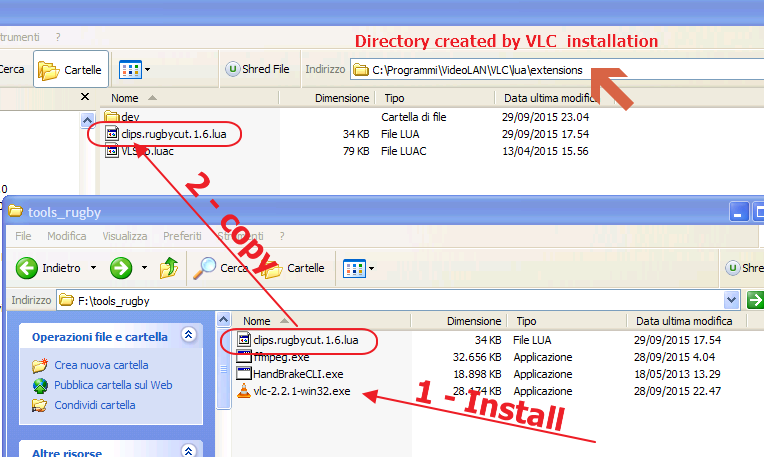

- [Download Handbrake (command line version)](https://handbrake.fr/downloads2.php "HandBrake") and copy it to c:\
- [If sill using XP, download old version](https://handbrake.fr/old.php "HandBrake XP")

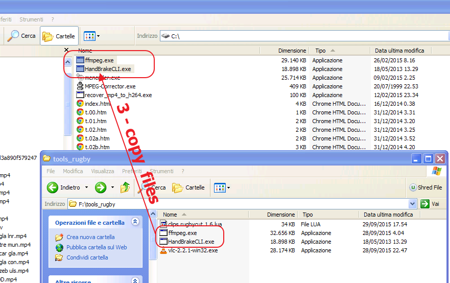

- Open .lua with you text editor and read how about

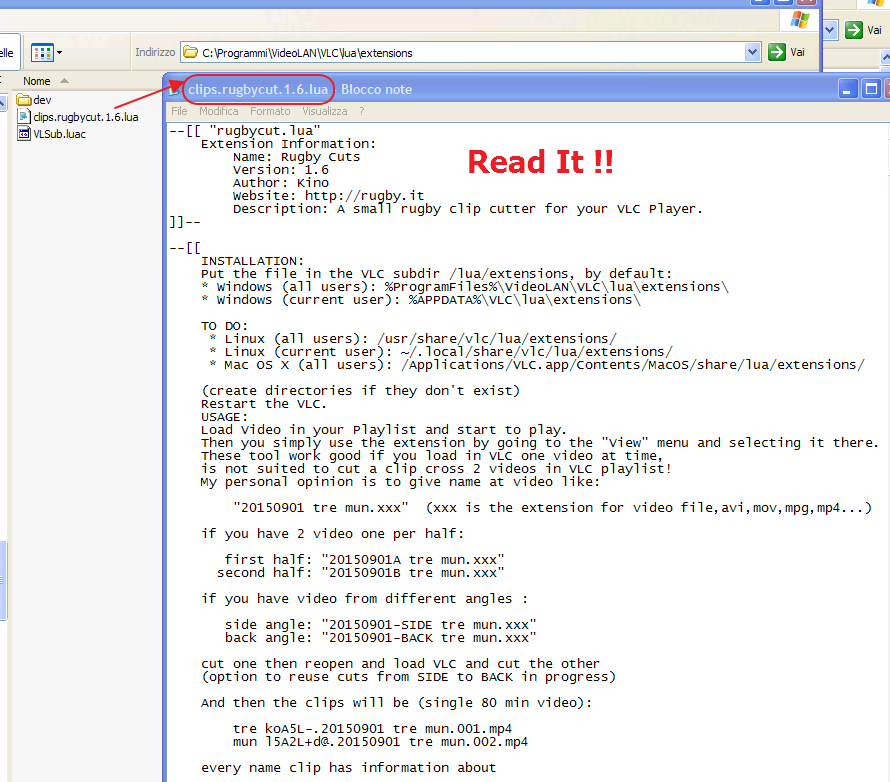

- Open VLC as administrator in win7/8 !!

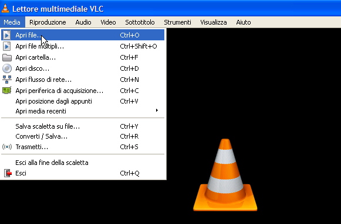

- Open the video match to cut. Please have a look to the name format of the video file: this is a match done 19 september 2015, Sandona versus Calvisano. I use the compact name "20150919 snd cal". Tre letters to identify the team like the score frame on television when you watch rugby matches  

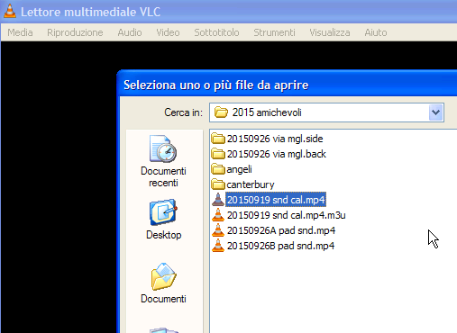

- Open the .lua extension from VLC

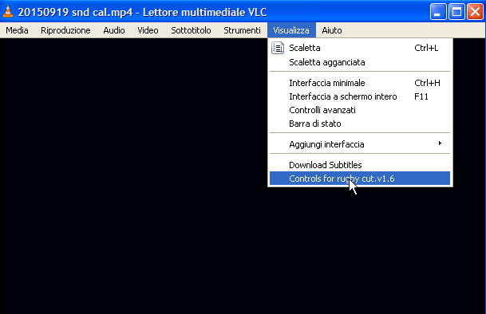

- Here the input frame and the video toghether,sorry  i cant capture any image due the VLC-video-overlay. But in the black window there is the video

- This is the input frame

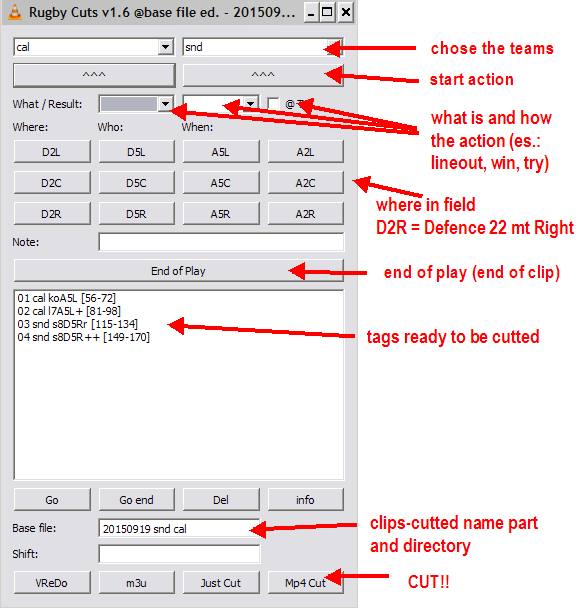

- in Italian, for my friends with English worse than mine

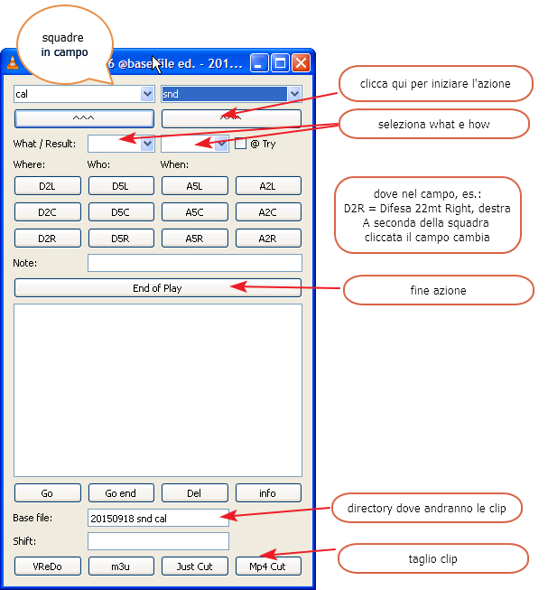

- Somethings to check: the 3 letters TEAMS

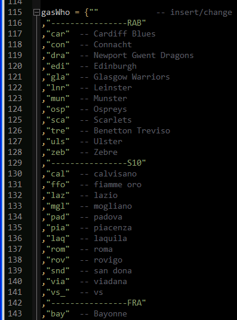

- 2 letters WHAT and the 12 field areas

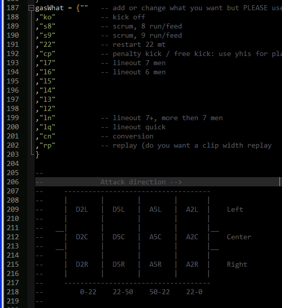

- HOW / RESULT

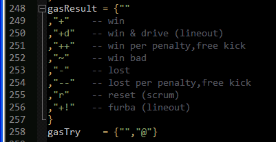

- Here at the end of the video with all the cuts (tags) made in the VLC extension frame
 
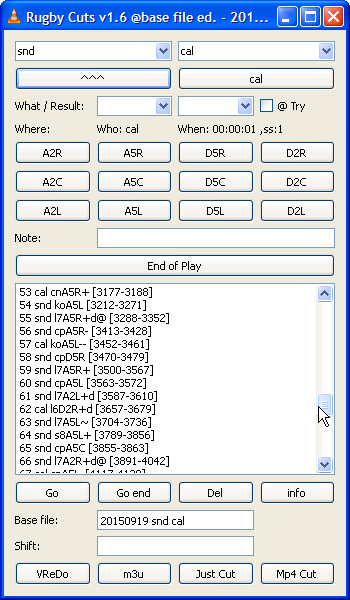

- About buttons....

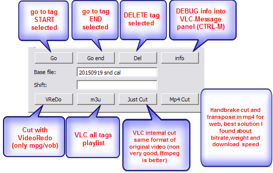

- About files created in the working directory

- Here, after the HandBrake transcode, the directory with all the clips

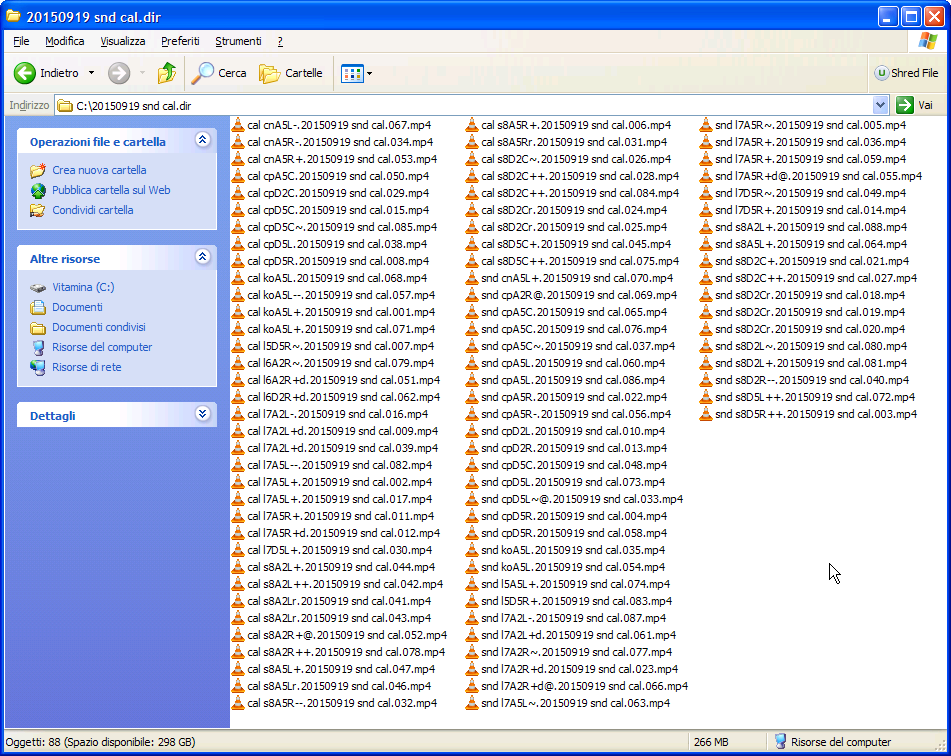

Really this is a brutal piece of programming without any bell and twinkle but is useful. 

With VLC fast motion (+/-) and mouse will (change mouse option to control position) I cut a match in about 25 minutes. 
After I group several matches cutted in a directory and analize from the the same set piece and field area to find recursive patterns. 

If you want all the lineout drive from Munster, just filter in the directory  

"mun l?+d" 
- mun = munster
- l = lineout
- ? = any men 
- \+ = win
- d = drive

or "mun*d" ... quicker

files names legenda:

